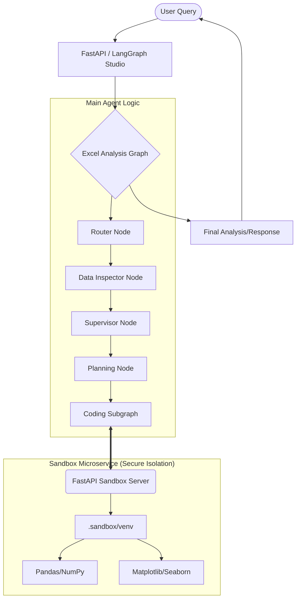
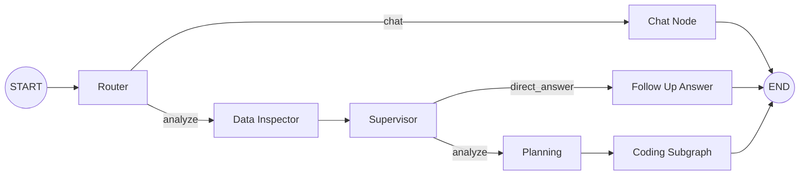

# 📊 Excel Analysis Agent

An intelligent, multi-agent AI system built with **LangGraph**, **LangChain**, and **FastAPI** that allows users to analyze complex Excel and CSV files through natural language queries.

---

## 🏗️ Architecture Overview

The Excel Analysis Agent utilizes a **microservice architecture** to ensure secure, isolated, and high-performance code execution.



---

## ✨ Key Features

- **🛡️ Secure Code Execution**: Agent-generated code runs in an isolated sandbox environment (FastAPI microservice).
- **🧩 Multi-Agent Orchestration**: Specialized nodes for data inspection, supervisory decision-making, meticulous planning, and recursive code generation.
- **📈 Advanced Visualization**: Automatically generates and serves high-quality plots (`matplotlib`, `seaborn`) back to the user.
- **⚡ Performance Optimized**: Utilizes a persistent sandbox state instead of serializing/deserializing large DataFrames between runs.
- **🧠 Reflection-Driven**: The coding agent uses a reflection tool (`think_tool`) to self-correct and optimize its analysis strategy.
- **💬 Conversational Context**: Fully supports multi-turn conversations through LangGraph's persistent state management.

---

## 🛤️ Agent Workflow (LangGraph)

The core logic is structured as a directed graph, ensuring reliable and predictable multi-step reasoning.



---

## 🛠️ Setup Instructions

### 1. Prerequisites
- Python 3.10+
- Git

### 2. Installation
Clone the repository and install dependencies:
```bash
git clone https://github.com/hiumesh/excel-analysis-agent.git
cd excel-analysis-agent
pip install -r requirements.txt
```

### 3. Initialize Sandbox
Set up the isolated virtual environment for code execution:
```bash
python setup_sandbox.py
```

### 4. Configuration
Create a `.env` file from the example:
```bash
cp .env.example .env
# Add your API keys (OPENAI_API_KEY, etc.)
```

---

## 🚀 Running the Agent

### Start the Execution Server
**IMPORTANT:** The sandbox server must be running in a separate terminal to allow the agent to execute code.
```bash
python run_sandbox_server.py
```

### Run the API Server
In your main terminal:
```bash
python main.py
```
The API will be available at `http://localhost:8000`.

### LangGraph Studio (Recommended for Dev)
Open this directory in LangGraph Studio for real-time visualization and debugging of the graph logic.

---

## 📁 Project Structure

- `my_agent/` - Core logic package
    - `agent.py` - Main graph definition
    - `nodes/` - Individual orchestration nodes (Planning, Supervisor, etc.)
    - `graphs/` - Subgraphs (Coding Agent Subgraph)
    - `tools/` - Sandbox tools (Python, Bash, Think)
    - `helpers/` - Sandbox client/server, and utilities
    - `core/` - Config and LLM initialization
- `data/` - (Auto-created) Stores checkpoints, uploads, and data sources
- `.sandbox/` - (Auto-created) The isolated execution environment
- `main.py` - FastAPI server entry point
- `setup_sandbox.py` - Sandbox initialization script

---

## 📑 Detailed Documentation

- [Sandbox Setup Guide](SANDBOX_SETUP.md) - Deep dive into the isolation architecture.
- [Conventional Commits](https://www.conventionalcommits.org/) - We follow strict commit standards for project history.

---

Built with ❤️ by the Excel Analysis Agent Team.
